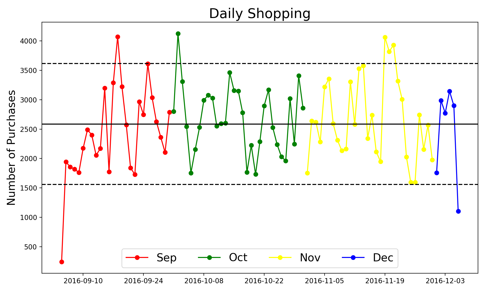
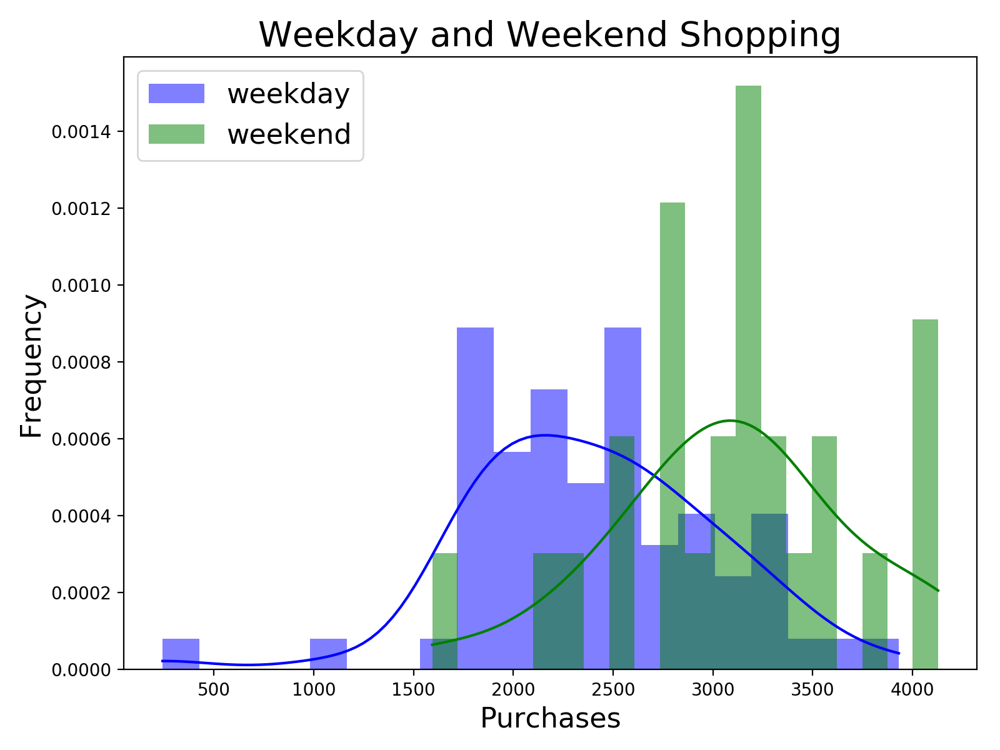
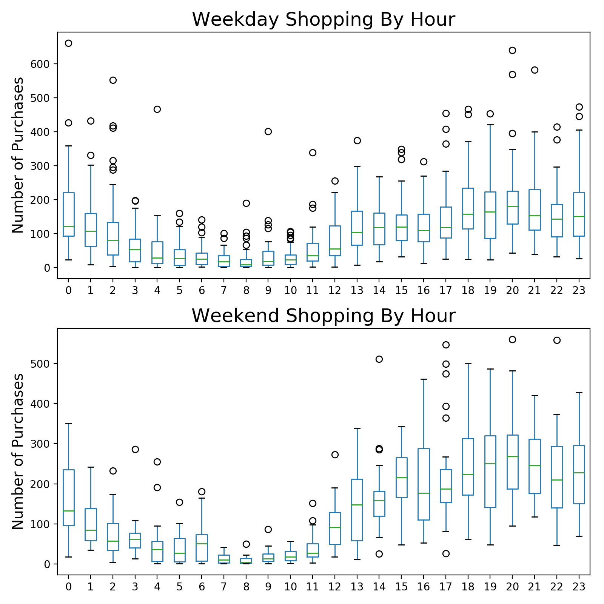

## Shopping Spree!

### Data imputation challenge
Prepared by Stuart King - September 2017  
Objectives:
1. Load data into a SQL database
2. Impute missing values using only SQL
3. Provide key data observations

### Table of Contents
- [Background](#background)
- [Databasing](#databasing)
- [Imputation Strategy](#imputation strategy)
- [Exploratory Data Analysis](#exploratory data analysis)
- [Observations](#observations)

### Background
We are given multiple datasets in `.csv` files that include messy item-level purchase, customer demographic, and retailer data, among other information. Using the provided data, we need to structure the data into tables within a PostgreSQL database, perform any necessary transformations, and impute missing values for receipt item prices and quantities, as well as the total price of receipts. Following all imputations and transformations, we then need to use the final output table to draw key insights related to the data.

### Databasing
My first step is to create a **PostgreSQL** database, establish tables for the various datasets, import the data into the newly created tables, and make any necessary updates, such as variable type transformations and data cleaning. To perform these steps I ran a series of queries. Initial queries include:
```sql
CREATE DATABASE shopping_spree;

CREATE TABLE receipts
(id varchar, customer_id varchar, retailer_id
varchar, created_at timestamp with time zone,
total_price varchar);

\copy receipts FROM 'data/receipts.csv' DELIMITER
',' CSV HEADER

UPDATE receipts
SET total_price = NULL
WHERE total_price = '(null)';

ALTER TABLE receipts
ALTER COLUMN total_price TYPE numeric USING
(total_price::numeric);

/* Add a new column to the receipts table to hold
the median total price of all receipts */
ALTER TABLE receipts
ADD median_total_price numeric;
```

### Imputation Strategy
To impute price and quantity values when missing or equal to zero for receipt items, I first created a temporary table that joins the `receipt_items` and `receipt_item_details` tables, keeping the variables I will need to help impute missing values. For price, the overarching assumption for making imputations is that a good approximation of a product's missing value is the average price of similar products. To do this, I first calculate the average price of the global product ID for which the product belongs to. If that value is either null or zero, I then calculate the average price based on the product's primary and secondary category classifications. If the imputed value is still either null or zero, I then calculate the average based on the product's retailer and brand IDs. Finally, if the imputed value is still null or zero, I use the global median price as the product's imputed value. A similar process is followed for calculating missing product quantities. The assumption here is that similar products are bought in similar quantities.

```sql
CREATE TEMPORARY TABLE new_receipt_items AS
  WITH s AS (
    SELECT r.id, ri.receipt_item_id, rid.global_product_id,
    rid.primary_category_id, rid.secondary_category_id,
    rid.tertiary_category_id, ri.price, ri.median_price, ri.quantity,
    ri.median_qty, rid.brand_id, r.retailer_id
    FROM receipt_items AS ri
    JOIN receipt_item_details AS rid
    ON ri.receipt_item_id = rid.receipt_item_id
    JOIN receipts AS r
    ON rid.receipt_id = r.id)

    SELECT s.id AS receipt_id, s.receipt_item_id, s.global_product_id,
    s.retailer_id, s.brand_id, s.primary_category_id, s.secondary_category_id,
    s.tertiary_category_id, s.price,

      CASE
      WHEN s.price <> 0 AND s.price IS NOT NULL <> 0 THEN s.price

      WHEN ((s.price = 0 OR s.price IS NULL) AND (ROUND(AVG(s.price)
      OVER(PARTITION BY s.global_product_id),2) IS NOT NULL AND
      ROUND(AVG(s.price) OVER(PARTITION BY s.global_product_id),2) <> 0)) THEN
      ROUND(AVG(s.price) OVER(PARTITION BY s.global_product_id),2)

      WHEN ((s.price = 0 OR s.price IS NULL) AND (ROUND(AVG(s.price)
      OVER(PARTITION BY s.global_product_id),2) IS NULL OR ROUND(AVG(s.price)
      OVER(PARTITION BY s.global_product_id),2) = 0) AND (ROUND(AVG(s.price)
      OVER(PARTITION BY s.primary_category_id, s.secondary_category_id),2) IS
      NOT NULL) AND (ROUND(AVG(s.price) OVER(PARTITION BY
      s.primary_category_id, s.secondary_category_id),2) <> 0)) THEN
      ROUND(AVG(s.price) OVER(PARTITION BY s.primary_category_id,
      s.secondary_category_id),2)

      WHEN ((s.price = 0 OR s.price IS NULL) AND (ROUND(AVG(s.price)
      OVER(PARTITION BY s.global_product_id),2) IS NULL OR ROUND(AVG(s.price)
      OVER(PARTITION BY s.global_product_id),2) = 0) AND (ROUND(AVG(s.price)
      OVER(PARTITION BY s.primary_category_id, s.secondary_category_id),2) IS
      NULL OR ROUND(AVG(s.price) OVER(PARTITION BY s.primary_category_id,
      s.secondary_category_id),2) = 0) AND (ROUND(AVG(s.price) OVER(PARTITION
      BY s.retailer_id, s.brand_id),2) IS NOT NULL) AND (ROUND(AVG(s.price)
      OVER(PARTITION BY s.retailer_id, s.brand_id),2) <> 0)) THEN
      ROUND(AVG(s.price) OVER(PARTITION BY s.retailer_id, s.brand_id),2)

      WHEN ((s.price = 0 OR s.price IS NULL) AND (ROUND(AVG(s.price)
      OVER(PARTITION BY s.global_product_id),2) IS NULL OR ROUND(AVG(s.price)
      OVER(PARTITION BY s.global_product_id),2) = 0) AND (ROUND(AVG(s.price)
      OVER(PARTITION BY s.primary_category_id, s.secondary_category_id),2) IS
      NULL OR ROUND(AVG(s.price) OVER(PARTITION BY s.primary_category_id,
      s.secondary_category_id),2) = 0) AND (ROUND(AVG(s.price) OVER(PARTITION
      BY s.retailer_id, s.brand_id),2) IS NULL OR ROUND(AVG(s.price)
      OVER(PARTITION BY s.retailer_id, s.brand_id),2) = 0)) THEN s.median_price

      END AS imputed_price,

      CASE
      WHEN s.price = 0 OR s.price IS NULL THEN 'yes'
      ELSE 'no'
      END AS flag_price_imputed,

      s.quantity,

      CASE
      WHEN s.quantity <> 0 AND s.quantity IS NOT NULL THEN s.quantity

      WHEN ((s.quantity = 0 OR s.quantity IS NULL) AND (ROUND(AVG(s.quantity)
      OVER(PARTITION BY s.global_product_id),0) IS NOT NULL) AND
      (ROUND(AVG(s.quantity) OVER(PARTITION BY s.global_product_id),0) <> 0))
      THEN ROUND(AVG(s.quantity) OVER(PARTITION BY s.global_product_id),0)

      WHEN ((s.quantity = 0 OR s.quantity IS NULL) AND (ROUND(AVG(s.quantity)
      OVER(PARTITION BY s.global_product_id),0) IS NULL OR
      ROUND(AVG(s.quantity) OVER(PARTITION BY s.global_product_id),0) = 0) AND
      (ROUND(AVG(s.quantity) OVER(PARTITION BY s.primary_category_id,
      s.secondary_category_id),0) IS NOT NULL) AND (ROUND(AVG(s.quantity)
      OVER(PARTITION BY s.primary_category_id, s.secondary_category_id),0) <>
      0)) THEN ROUND(AVG(s.quantity) OVER(PARTITION BY s.primary_category_id,
      s.secondary_category_id),0)

      WHEN ((s.quantity = 0 OR s.quantity IS NULL) AND (ROUND(AVG(s.quantity)
      OVER(PARTITION BY s.global_product_id),0) IS NULL OR
      ROUND(AVG(s.quantity) OVER(PARTITION BY s.global_product_id),0) = 0) AND
      (ROUND(AVG(s.quantity) OVER(PARTITION BY s.primary_category_id,
      s.secondary_category_id),0) IS NULL OR ROUND(AVG(s.quantity)
      OVER(PARTITION BY s.primary_category_id, s.secondary_category_id),0) = 0)
      AND (ROUND(AVG(s.quantity) OVER(PARTITION BY s.retailer_id,
      s.brand_id),0) IS NOT NULL) AND (ROUND(AVG(s.quantity) OVER(PARTITION BY
      s.retailer_id, s.brand_id),0) <> 0)) THEN ROUND(AVG(s.quantity)
      OVER(PARTITION BY s.retailer_id, s.brand_id),0)

      WHEN ((s.quantity = 0 OR s.quantity IS NULL) AND (ROUND(AVG(s.quantity)
      OVER(PARTITION BY s.global_product_id),0) IS NULL OR
      ROUND(AVG(s.quantity) OVER(PARTITION BY s.global_product_id),0) = 0) AND
      (ROUND(AVG(s.quantity) OVER(PARTITION BY s.primary_category_id,
      s.secondary_category_id),0) IS NULL OR ROUND(AVG(s.quantity)
      OVER(PARTITION BY s.primary_category_id, s.secondary_category_id),0) = 0)
      AND (ROUND(AVG(s.quantity) OVER(PARTITION BY s.retailer_id,
      s.brand_id),0) IS NULL OR ROUND(AVG(s.quantity) OVER(PARTITION BY
        s.retailer_id, s.brand_id),0) = 0)) THEN s.median_qty

      END AS imputed_quantity,

      CASE
      WHEN s.quantity = 0 OR s.quantity IS NULL THEN 'yes'
      ELSE 'no'
      END AS flag_qty_imputed

    FROM s;
```

Similarly, to impute missing receipt total prices, I used the average total price based on the customer's shopping habits by retailer. If this imputation results in a null or zero value, I then calculate the average total price based solely on the retailer. Finally, if neither of the two above calculations yield a non-null and non-zero value, I use the global median as the imputed value. My assumption for this imputation approach is that customers will spend approximately the same amount by retailer.

```sql
CREATE TEMPORARY TABLE new_receipts AS
  SELECT r.*,
    CASE
    WHEN r.total_price <> 0 AND r.total_price IS NOT NULL THEN r.total_price

    WHEN ((r.total_price = 0 OR r.total_price IS NULL) AND
    (ROUND(AVG(r.total_price) OVER (PARTITION BY r.customer_id,
    r.retailer_id),2) IS NOT NULL) AND (ROUND(AVG(r.total_price) OVER
    (PARTITION BY r.customer_id, r.retailer_id),2) <> 0)) THEN
    ROUND(AVG(r.total_price) OVER (PARTITION BY r.customer_id, r.retailer_id),2)

    WHEN ((r.total_price = 0 OR r.total_price IS NULL) AND
    (ROUND(AVG(r.total_price) OVER (PARTITION BY r.customer_id,
    r.retailer_id),2) IS NULL OR ROUND(AVG(r.total_price) OVER (PARTITION BY
    r.customer_id, r.retailer_id),2) = 0) AND (ROUND(AVG(r.total_price) OVER
    (PARTITION BY r.retailer_id),2) IS NOT NULL) AND (ROUND(AVG(r.total_price)
    OVER (PARTITION BY r.retailer_id),2) <> 0)) THEN ROUND(AVG(r.total_price)
    OVER (PARTITION BY r.retailer_id),2)

    WHEN ((r.total_price = 0 OR r.total_price IS NULL) AND
    (ROUND(AVG(r.total_price) OVER (PARTITION BY r.customer_id,
    r.retailer_id),2) IS NULL OR ROUND(AVG(r.total_price) OVER (PARTITION BY
    r.customer_id, r.retailer_id),2) = 0) AND (ROUND(AVG(r.total_price) OVER
    (PARTITION BY r.retailer_id),2) IS NULL OR ROUND(AVG(r.total_price) OVER
    (PARTITION BY r.retailer_id),2) = 0)) THEN r.median_total_price

    END AS imputed_total_price,

    CASE
    WHEN r.total_price = 0 OR r.total_price IS NULL THEN 'yes'
    ELSE 'no'
    END AS flag_total_price_imputed

  FROM receipts AS r;
```

After imputing missing values, I create a final output table that will be used to provide relevant business insights.

```sql
CREATE TABLE final_output AS
  SELECT c.id AS customer_id, c.gender, date_part('year', age(c.birth_date)) AS
  age, c.education, c.state, nr.retailer_id, rt.retailer_type, nr.id AS
  receipt_id, nr.imputed_total_price AS total_price, nr.created_at AT TIME ZONE
  'MST' AS created_at_mst, nri.receipt_item_id, nri.primary_category_id,
  nri.secondary_category_id, nri.tertiary_category_id, b.name AS brand_name,
  nri.global_product_id, nri.imputed_price AS price, nri.imputed_quantity AS
  quantity, nri.flag_price_imputed, nri.flag_qty_imputed

  FROM new_receipt_items AS nri
  LEFT JOIN new_receipts AS nr
  ON nri.receipt_id = nr.id
  LEFT JOIN customers AS c
  ON nr.customer_id = c.id
  LEFT JOIN retailers AS rt
  ON nr.retailer_id = rt.id
  LEFT JOIN brands AS b
  ON nri.brand_id = b.id;
```
To streamline the creation of the final output table, I also developed a [`sql_pipeline.py`](sql_pipeline.py) script to execute a series of SQL queries and save the final table to file.

### Exploratory Data Analysis
Using the `final_output` table created, I then performed exploratory data analysis using SQL and Python. SQL queries and their results include the following, and Python code to create helpful visualizations is included in [`eda.py`](eda.py).

```sql
/* Average age by gender */

WITH temp AS (
  SELECT DISTINCT(customer_id), gender, age
  FROM final_output)
    SELECT DISTINCT(gender), AVG(age) AS average_age
    FROM temp
    WHERE age <= 90
    GROUP BY 1;

/* 37.7 for females, 35.8 for males */
```

```sql
/* Gender distribution */

WITH temp AS (
  SELECT DISTINCT(customer_id), gender
  FROM final_output)

  SELECT DISTINCT(gender),
     COUNT(gender) AS gender_count,
     ROUND(COUNT(gender) * 100.0 / (SELECT COUNT(*) FROM temp),2)
     AS gender_percent
  FROM temp
  GROUP BY 1;
```
| gender | gender_count | gender_percent |
| ------ | ------------ | -------------- |
| F      |         1894 |          80.42 |  
| M      |          289 |          12.27 |  
| null   |          172 |           7.30 |  

```sql
/* Proportion of consumers by education */

WITH temp AS (
  SELECT DISTINCT(customer_id), education
  FROM final_output)

  SELECT DISTINCT(education),
     COUNT(education) AS education_count,
     ROUND(COUNT(education) * 100.0 / (SELECT COUNT(*) FROM
     temp),2) AS education_percent
  FROM temp
  GROUP BY 1
  ORDER BY education_percent DESC;
```
| education                | education_count | education_percent |
| ------------------------ | --------------- | ----------------- |
| null                     |             920 |             39.07 |
| Bachelor Degree          |             339 |             14.39 |
| Some College (No Degree) |             335 |             14.23 |
| High School              |             223 |              9.47 |
| Associates               |             193 |              8.20 |
| Masters                  |             163 |              6.92 |
| College                  |              46 |              1.95 |
| Other                    |              43 |              1.83 |
| Professional Degree      |              39 |              1.66 |
| Doctorate                |              26 |              1.10 |
| Graduate School          |              10 |              0.42 |

```sql
/* Proportion of receipts by retailer type */

WITH temp AS (
  SELECT DISTINCT(receipt_id), retailer_type
  FROM final_output)

  SELECT DISTINCT(retailer_type),
     COUNT(retailer_type) AS retailer_count,
     ROUND(COUNT(retailer_type) * 100.0 / (SELECT COUNT(*) FROM
     temp),2) AS retailer_percent
  FROM temp
  GROUP BY 1
  ORDER BY retailer_percent DESC;
```
| retailer_type        | retailer_count | retailer_percent |
| -------------------- | -------------- | ---------------- |
| Grocery              |          18289 |            89.02 |
| Pharmacy             |           1256 |             6.11 |
| Convenience          |            501 |             2.44 |
| Dollar Store         |            215 |             1.05 |
| Beer, Wine & Spirits |            204 |             0.99 |
| Restaurant           |             48 |             0.23 |
| Arts & Crafts        |             16 |             0.08 |
| Mass Merchandise     |              7 |             0.03 |
| Toy                  |              4 |             0.02 |
| Home Improvement     |              2 |             0.01 |
| Pet                  |              2 |             0.01 |
| Electronics          |              1 |             0.00 |

### Observations
The data provides key insights related to female consumers in their mid-to-late 30s, an often-targeted demographic. Most notably, for food items consumers are purchasing produce and other common brands, and are conducting their shopping late in the day. Weekend shopping tends to be preferred, with greater variability in total number of purchases.

**General Descriptive Statistics**  
Female consumers constitute 80 percent of all users, and after accounting for outliers, the average age of a consumer is 37 years old. These two features are likely helpful to a variety of retailers. Analyzing the data on a state-by-state basis, the top three states represented in the data include Texas, North Carolina, and Pennsylvania. After accounting for outliers (first removing extreme outliers by manually inspecting the data, and then by setting all values above or below three standard deviations from the mean to zero before imputing values), the three states with the greatest average spend include Maine, Arkansas, and North Dakota. Produce represents the greatest proportion of brands for which information was available, with brands such as Great Value, Food Lion, Kroger, Campbell’s, Kraft, and Yoplait representing other commonly purchased brands. These statistics dovetail from the fact that 89 percent of shopping was done at grocery stores.

**Time Series Analysis**  
The dataset covers purchases made between September and December 2016. Analyzing the trend of purchases over this time period is useful to confirm certain expectations about consumer behavior, and potentially discover new insights. A month-by-month comparison (**Figure 1**) suggests there is significant variability in the number of purchases on a daily basis, potentially indicative of weekday vs. weekend shopping. In addition, the peak of activity in late November likely corresponds to Black Friday shopping. When examining the histogram of purchases for weekday and weekend activity (**Figure 2**), we can see from the normalized frequencies that individuals are more frequently taking care of their shopping needs on the weekends. Furthermore, we can evaluate purchases on an hourly basis. Based on the hour-by-hour boxplots (**Figure 3**) for weekday and weekend shopping, we see that regardless of the day, people tend to do their shopping later in the day. This early vs. late shopping distinction is even more pronounced on the weekends, and late-in-the-day weekend shoppers tend to exhibit a greater variability in their shopping compared to weekday shoppers. Some applicable insights here for retailers, and grocers in particular, is that shoppers have a greater tendency to do their shopping late in the day, regardless of whether it is the weekend or during the week, and shoppers may be inclined to make more purchases on the weekend. This information could be useful for targeted marketing campaigns, or for ensuring stores are properly staffed at the right times of the day.

Figure 1:  


Figure 2:  


Figure 3:    


**Limitations and Future Analysis**  
Some general assumptions were used to manipulate the data. These assumptions and subsequent manipulations impact the overall analysis of the data. For example, extreme outliers may in fact be vital to the dataset, and their removal compromises certain analyses. For future analysis, I would perform a more in-depth look at consumer habits by retail industry. But in general, the possibilities are endless for a dataset such as this.
